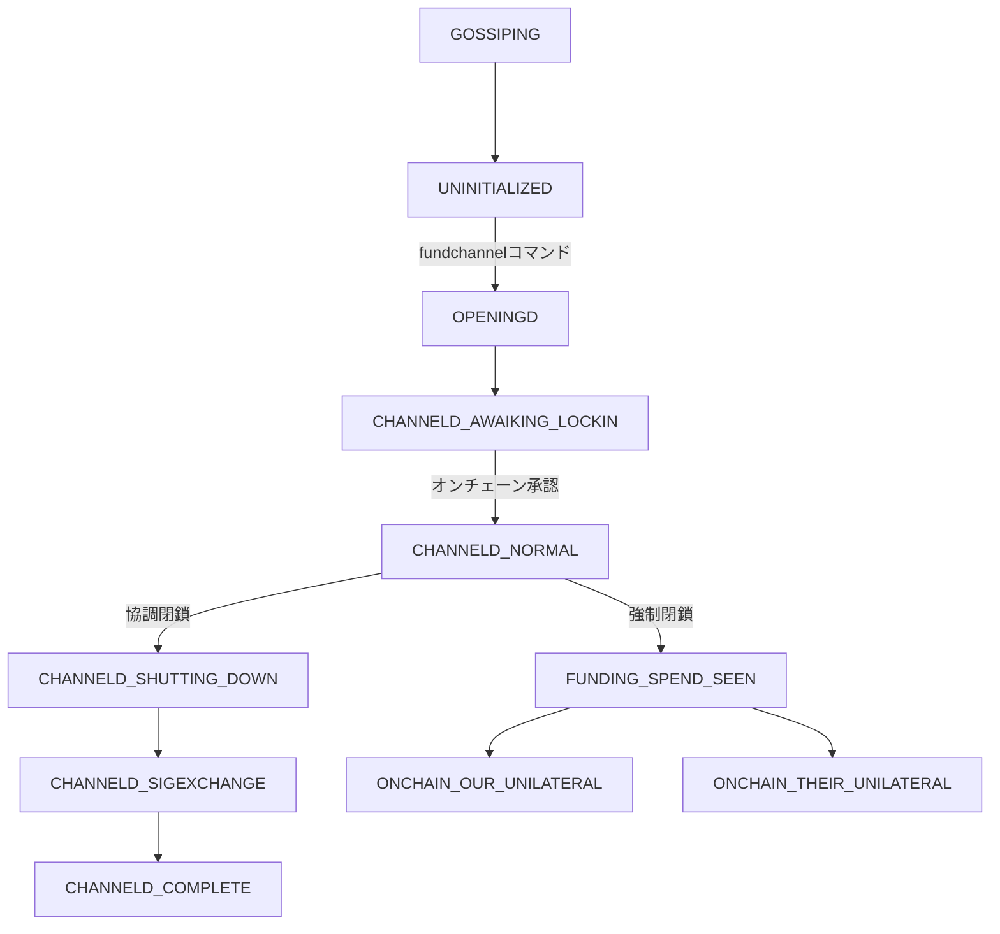

```mermaid
graph TD;
    GOSSIPING--->A[UNINITIALIZED];
    A--"fundchannelコマンド"-->B[OPENINGD];
    B-->C[CHANNELD_AWAIKING_LOCKIN];
    C--オンチェーン承認-->D[CHANNELD_NORMAL];

    D--"協調閉鎖"-->E[CHANNELD_SHUTTING_DOWN];
    E-->F[CHANNELD_SIGEXCHANGE];
    F-->CHANNELD_COMPLETE;
    
    D--"強制閉鎖"-->G[FUNDING_SPEND_SEEN];
    G-->ONCHAIN_OUR_UNILATERAL;
    G-->ONCHAIN_THEIR_UNILATERAL;
```
