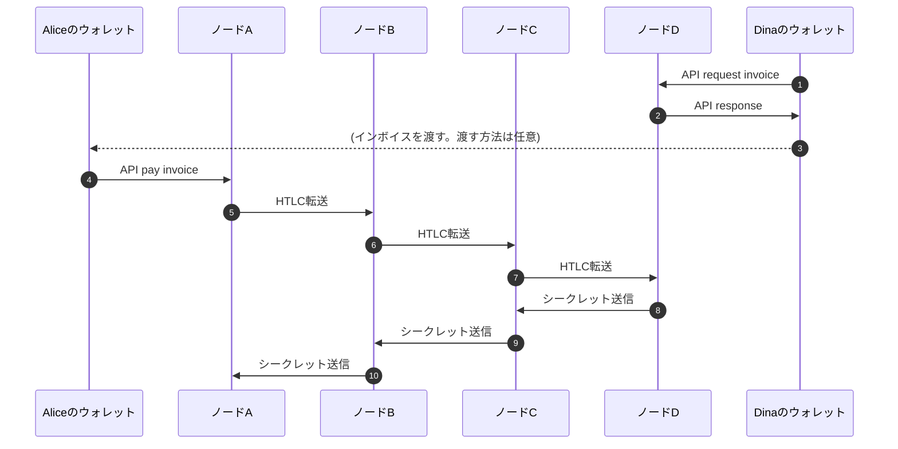

Aliceが支払人 
Dinaが受取人 
Dinaはインボイスを発行してAliceに渡す 
Aliceはインボイスを使ってDinaへ送金

※通常ノードDからのシークレット(別称プリイメジ)送信は迅速に行われるが、HODLインボイスだと意図的に抑制する。 
ノードDにおいてHODLインボイス決済APIが操作されるまでシークレット送信しないという仕組み。HODLインボイスを解析しても通常インボイスとは見分けが付かない。
