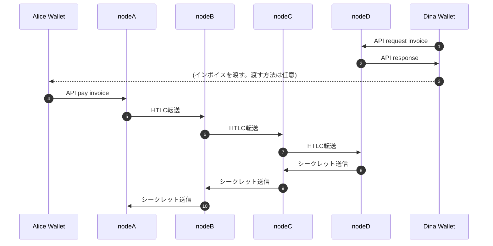

```mermaid
sequenceDiagram
    participant Alice Wallet
    participant nodeA
    participant nodeB
    participant nodeC
    participant nodeD
    participant Dina Wallet

    autonumber
    Dina Wallet->>nodeD: API request invoice
    nodeD->>Dina Wallet: API response
    Dina Wallet-->>Alice Wallet: (インボイスを渡す。渡す方法は任意)

    Alice Wallet->>nodeA: API pay invoice

    nodeA->>nodeB: HTLC転送
    nodeB->>nodeC: HTLC転送
    nodeC->>nodeD: HTLC転送
    nodeD->>nodeC: シークレット送信
    nodeC->>nodeB: シークレット送信
    nodeB->>nodeA: シークレット送信

```
