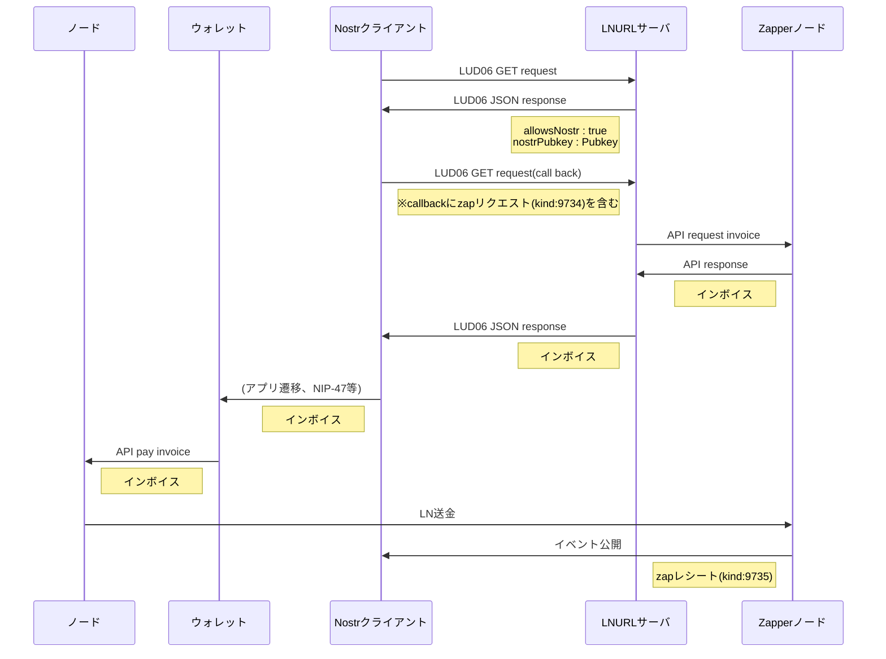

```mermaid
sequenceDiagram
    participant ノード
    participant ウォレット
    participant Nostrクライアント
    participant LNURLサーバ
    participant Zapperノード

    Nostrクライアント->>LNURLサーバ: LUD06 GET request

    LNURLサーバ->>Nostrクライアント: LUD06 JSON response
    Note left of LNURLサーバ: allowsNostr : true <br/>nostrPubkey : Pubkey
    
    Nostrクライアント->>LNURLサーバ: LUD06 GET request(call back) 
    Note right of Nostrクライアント: ※callbackにzapリクエスト(kind:9734)を含む
    
    LNURLサーバ->>Zapperノード: API request invoice
    
    Zapperノード->>LNURLサーバ: API response
    Note left of Zapperノード: インボイス
    
    LNURLサーバ->>Nostrクライアント: LUD06 JSON response
    Note left of LNURLサーバ: インボイス

    Nostrクライアント->>ウォレット: (アプリ遷移、NIP-47等)
    Note left of Nostrクライアント: インボイス

    ウォレット->>ノード: API pay invoice
    Note left of ウォレット: インボイス

    ノード->>Zapperノード: LN送金
    
    Zapperノード->>Nostrクライアント: イベント公開
    Note left of Zapperノード: zapレシート(kind:9735)

```
