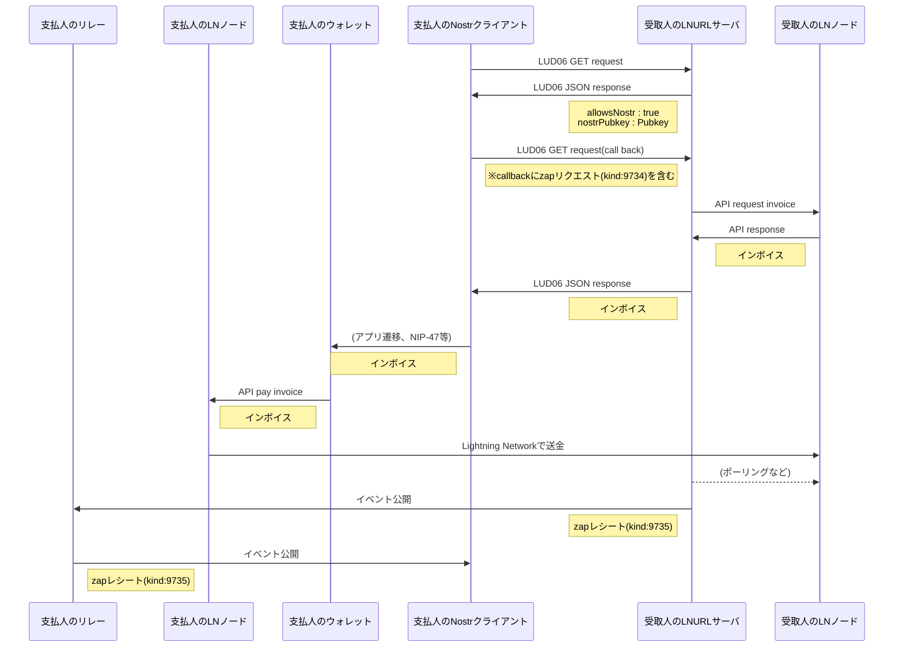

```mermaid
sequenceDiagram
    participant 支払人のリレー
    participant 支払人のLNノード
    participant 支払人のウォレット
    participant 支払人のNostrクライアント
    participant 受取人のLNURLサーバ
    participant 受取人のLNノード

    支払人のNostrクライアント->>受取人のLNURLサーバ: LUD06 GET request

    受取人のLNURLサーバ->>支払人のNostrクライアント: LUD06 JSON response
    Note left of 受取人のLNURLサーバ: allowsNostr : true <br/>nostrPubkey : Pubkey
    
    支払人のNostrクライアント->>受取人のLNURLサーバ: LUD06 GET request(call back) 
    Note right of 支払人のNostrクライアント: ※callbackにzapリクエスト(kind:9734)を含む
    
    受取人のLNURLサーバ->>受取人のLNノード: API request invoice
    
    受取人のLNノード->>受取人のLNURLサーバ: API response
    Note left of 受取人のLNノード: インボイス
    
    受取人のLNURLサーバ->>支払人のNostrクライアント: LUD06 JSON response
    Note left of 受取人のLNURLサーバ: インボイス

    支払人のNostrクライアント->>支払人のウォレット: (アプリ遷移、NIP-47等)
    Note left of 支払人のNostrクライアント: インボイス

    支払人のウォレット->>支払人のLNノード: API pay invoice
    Note left of 支払人のウォレット: インボイス

    支払人のLNノード->>受取人のLNノード: Lightning Networkで送金
    
    受取人のLNURLサーバ-->>受取人のLNノード: (ポーリングなど)
    
    受取人のLNURLサーバ->>支払人のリレー: イベント公開
    Note left of 受取人のLNURLサーバ: zapレシート(kind:9735)

    支払人のリレー->>支払人のNostrクライアント: イベント公開
    Note right of 支払人のリレー: zapレシート(kind:9735)

```
