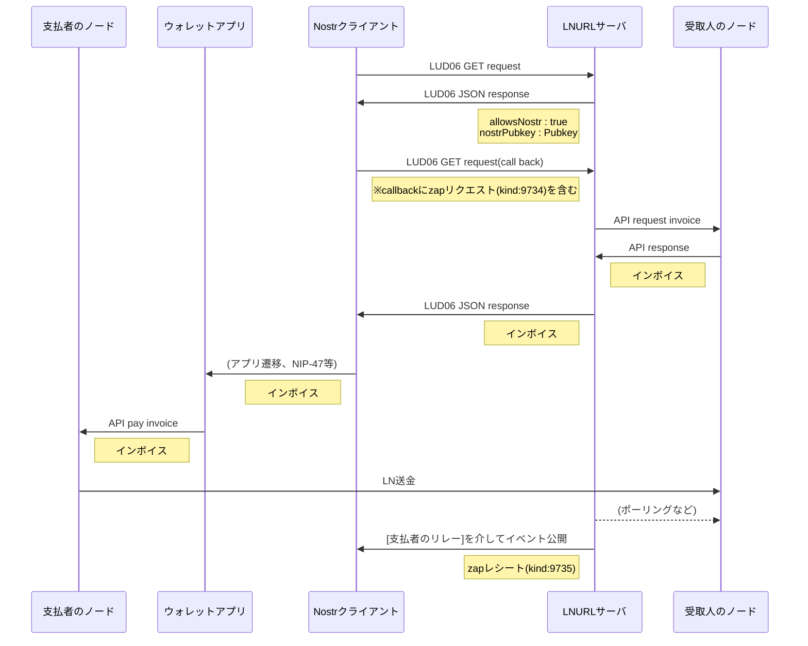

```mermaid
sequenceDiagram
    participant 支払者のノード
    participant ウォレットアプリ
    participant Nostrクライアント
    participant LNURLサーバ
    participant 受取人のノード

    Nostrクライアント->>LNURLサーバ: LUD06 GET request

    LNURLサーバ->>Nostrクライアント: LUD06 JSON response
    Note left of LNURLサーバ: allowsNostr : true <br/>nostrPubkey : Pubkey
    
    Nostrクライアント->>LNURLサーバ: LUD06 GET request(call back) 
    Note right of Nostrクライアント: ※callbackにzapリクエスト(kind:9734)を含む
    
    LNURLサーバ->>受取人のノード: API request invoice
    
    受取人のノード->>LNURLサーバ: API response
    Note left of 受取人のノード: インボイス
    
    LNURLサーバ->>Nostrクライアント: LUD06 JSON response
    Note left of LNURLサーバ: インボイス

    Nostrクライアント->>ウォレットアプリ: (アプリ遷移、NIP-47等)
    Note left of Nostrクライアント: インボイス

    ウォレットアプリ->>支払者のノード: API pay invoice
    Note left of ウォレットアプリ: インボイス

    支払者のノード->>受取人のノード: LN送金
    
    LNURLサーバ-->>受取人のノード: (ポーリングなど)
    
    LNURLサーバ->>Nostrクライアント: [支払者のリレー]を介してイベント公開
    Note left of LNURLサーバ: zapレシート(kind:9735)

```
