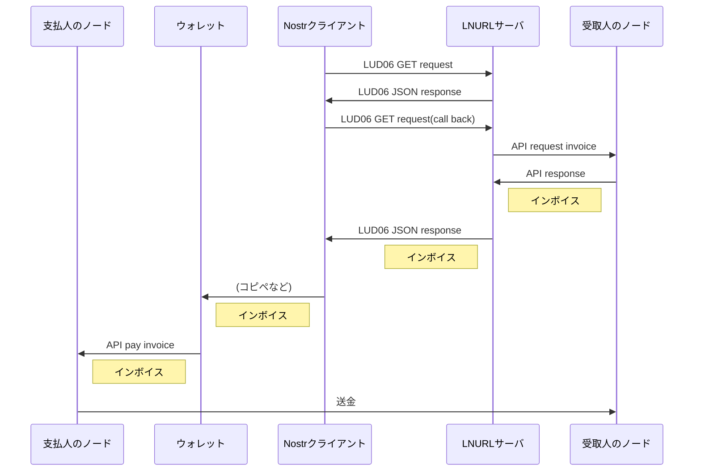

```mermaid
sequenceDiagram
    participant 支払人のノード
    participant ウォレット
    participant Nostrクライアント
    participant LNURLサーバ
    participant 受取人のノード

    Nostrクライアント->>LNURLサーバ: LUD06 GET request

    LNURLサーバ->>Nostrクライアント: LUD06 JSON response
    
    Nostrクライアント->>LNURLサーバ: LUD06 GET request(call back) 
    
    LNURLサーバ->>受取人のノード: API request invoice
    
    受取人のノード->>LNURLサーバ: API response
    Note left of 受取人のノード: インボイス
    
    LNURLサーバ->>Nostrクライアント: LUD06 JSON response
    Note left of LNURLサーバ: インボイス

    Nostrクライアント->>ウォレット: (コピペなど)
    Note left of Nostrクライアント: インボイス

    ウォレット->>支払人のノード: API pay invoice
    Note left of ウォレット: インボイス

    支払人のノード->>受取人のノード: 送金

```
