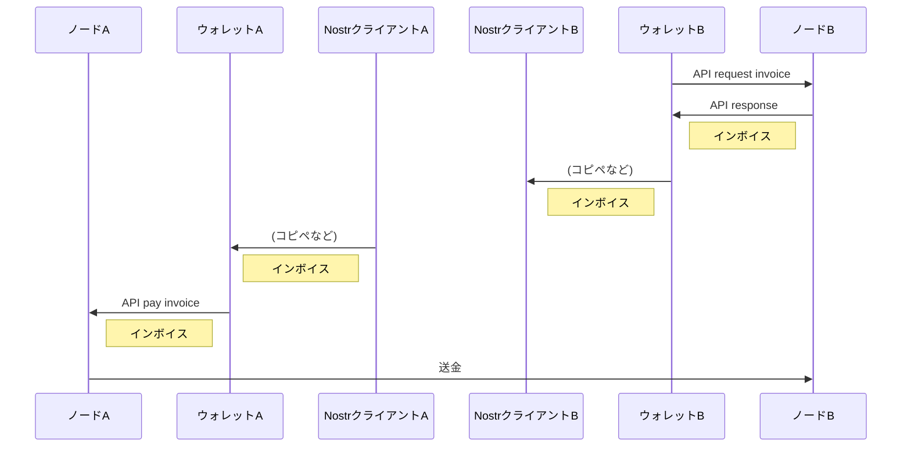

```mermaid
sequenceDiagram
    participant ノードA
    participant ウォレットA
    participant NostrクライアントA
    participant NostrクライアントB
    participant ウォレットB
    participant ノードB

    ウォレットB->>ノードB: API request invoice
    ノードB->>ウォレットB: API response
    Note left of ノードB: インボイス
    ウォレットB->>NostrクライアントB: (コピペなど) 
    Note left of ウォレットB: インボイス

    NostrクライアントA->>ウォレットA: (コピペなど)
    Note left of NostrクライアントA: インボイス
    ウォレットA->>ノードA: API pay invoice
    Note left of ウォレットA: インボイス
    ノードA->>ノードB: 送金

```
