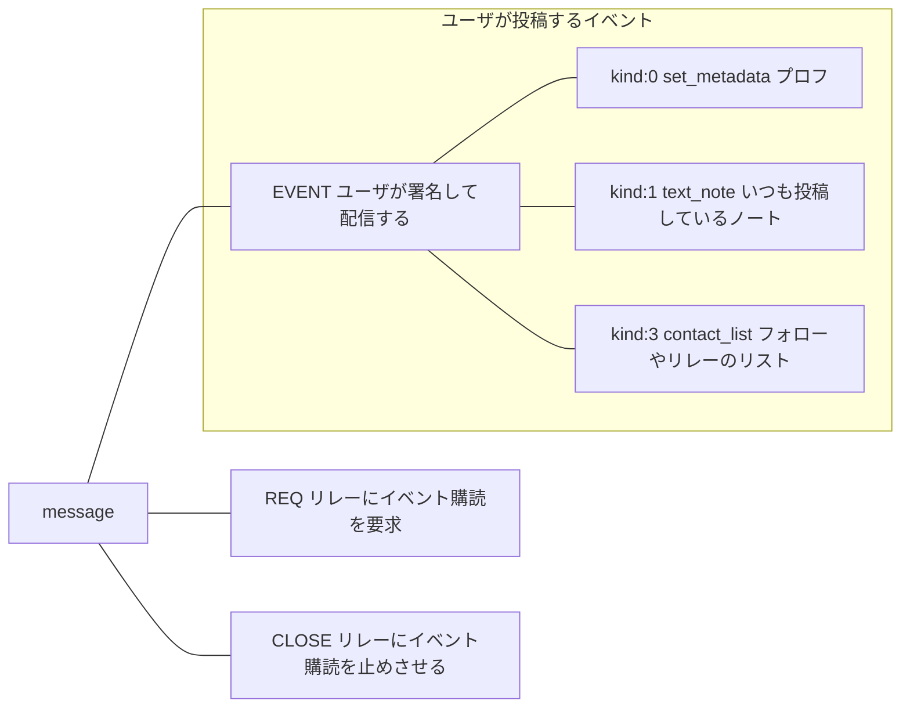

```mermaid
flowchart LR;
        message---REQ["REQ リレーにイベント購読を要求"];
        message---CLOSE["CLOSE リレーにイベント購読を止めさせる"];
        message---EVENT["EVENT ユーザが署名して配信する"];
    subgraph ユーザが投稿するイベント
        EVENT---0["kind:0 set_metadata プロフ"]
        EVENT---1["kind:1 text_note いつも投稿しているノート"];
        EVENT---3["kind:3 contact_list フォローやリレーのリスト"];
    end
```
