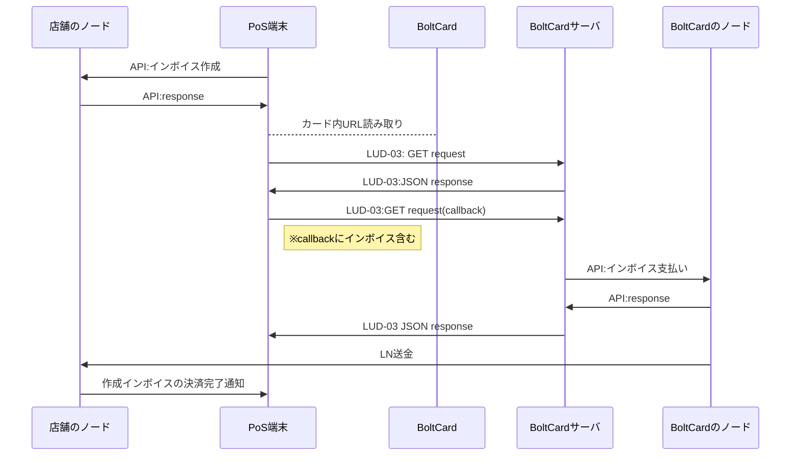

顧客が商品を選び、支払い画面に移行した後のフロー

```mermaid
sequenceDiagram
    participant 店舗のノード
    participant PoS端末
    participant BoltCard
    participant BoltCardサーバ
    participant BoltCardのノード


    PoS端末->>店舗のノード: API:インボイス作成
    店舗のノード->>PoS端末: API:response
    PoS端末-->BoltCard: カード内URL読み取り

    PoS端末->>BoltCardサーバ: LUD-03: GET request
    BoltCardサーバ->>PoS端末: LUD-03:JSON response
    PoS端末->>BoltCardサーバ: LUD-03:GET request(callback)
    Note right of PoS端末: ※callbackにインボイス含む
    BoltCardサーバ->>BoltCardのノード: API:インボイス支払い
　　BoltCardのノード->>BoltCardサーバ: API:response
    BoltCardサーバ->>PoS端末: LUD-03 JSON response

    BoltCardのノード->>店舗のノード: LN送金
    店舗のノード->>PoS端末: 作成インボイスの決済完了通知

```
